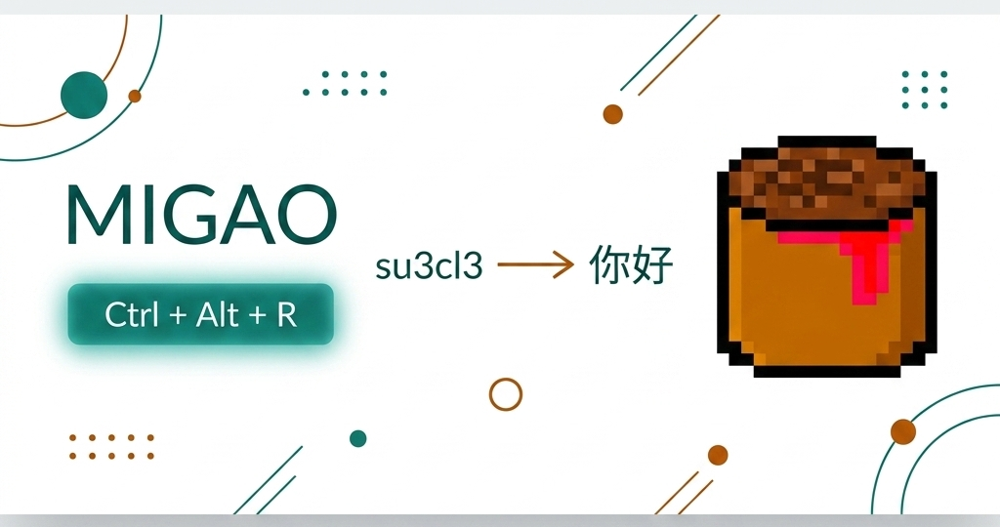

# 翻译米糕 Migao

[繁體中文](README.zh-TW.md) | **[English](../README.md)** | [日本語](README.ja.md) | [한국어](README.ko.md) | 简体中文

<div align="center">
  
  <br>
  <strong>拼音乱码修正，持续优化中——欢迎贡献！</strong>
</div>

<br>

> **当前状态：** 拼音（全拼 QWERTY）支援已内置，但短词准确度仍在调校中。5 字节以上的句子效果良好；1–2 字节输入可能出现误判。欢迎开源贡献者协助改进 Viterbi 参数与词频资料。
>
> **贡献方向：** 拼音准确度调校 · [ROADMAP](https://github.com/winterdrive/migao/blob/main/ROADMAP.md) · [参与讨论](https://github.com/winterdrive/migao/issues)

**拼音 IME 乱码修正工具。**

忘记切换输入法，打出一串看不懂的英文字？`su3cl3` 其实是「你好」。Migao 可以把选中的乱码直接还原成中文，不需要重打。

```
输入:   su3cl3
选择:   Ctrl+A
修正:   Ctrl+Alt+R
结果:   你好
```

## 安装

### Windows 一键安装

```powershell
irm https://raw.githubusercontent.com/winterdrive/migao/main/install.ps1 | iex
```

安装内容包含 `migao` CLI、`migao-watch` 后台常驻程序、PATH 设置、开始菜单快捷方式，并会询问是否开机自启。

卸载：

```powershell
& ([scriptblock]::Create((irm https://raw.githubusercontent.com/winterdrive/migao/main/install.ps1))) -Uninstall
```

## Windows 日常使用 *（仅限 Windows）*

`migao-watch` 目前仅支援 Windows。macOS / Linux 欢迎贡献——请至 [Issues](https://github.com/winterdrive/migao/issues) 讨论或认领。
目前有两种替代方案：**CLI pipe：** `pbpaste | migao fix | pbcopy`（macOS）或 `xclip -o | migao fix | xclip -i`（Linux）；**AI agent：** 见 [`skills/migao/SKILL.md`](../skills/migao/SKILL.md)

1. 从开始菜单启动 **Migao Watch**，或让它开机自动启动。
2. 照常打字。如果忘记切换输入法而产生乱码，选中它；在很多编辑器里，**Ctrl+A** 可以选中整个输入框。
3. 按 **Ctrl+Alt+R**，选中的文字会就地替换成正确中文。
4. 3 秒内再次按 **Ctrl+Alt+R** 可以切换候选答案。

手动启动不需要保持 PowerShell 窗口开启。

## CLI

```sh
migao fix "su3cl3"           # 你好
migao fix "5j/ eji6"         # 中国
migao fix --top 3 "su3cl3"   # 显示多个候选
migao list                   # 列出支持的 IME
```

## 支持的输入法

| 识别码 | 别名 | 键盘布局 |
|--------|------|----------|
| `bopomofo-daqian` | `zhuyin`, `注音` | 大千标准注音键盘 |
| `pinyin` | `拼音` | 全拼 QWERTY |

## 许可证

MIT AND Apache-2.0

Apache 2.0 部分覆盖嵌入 binary 的 RIME 字典资料。
